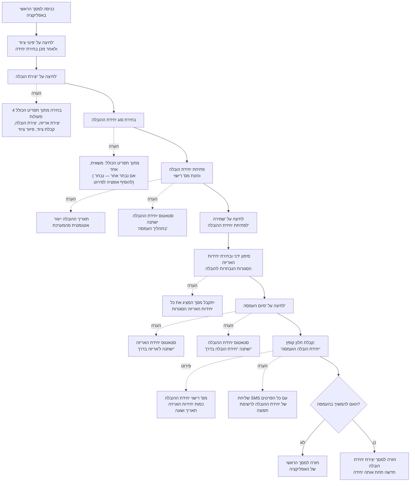

# תהליך ההובלה

## מקרא (Legend)

| סימן | משמעות |
|---|---|
| ⬛➡️ (חץ שחור) | פעולה |
| 🔴➡️ (חץ אדום) | "לא" |
| 🟢➡️ (חץ ירוק) | "כן" |
| ◆ (מעוין אפור) | הערה |
| קו תכלת עם קו תחתון | תנאי למעבר למסך הבא |

---

## תהליך ההובלה 

